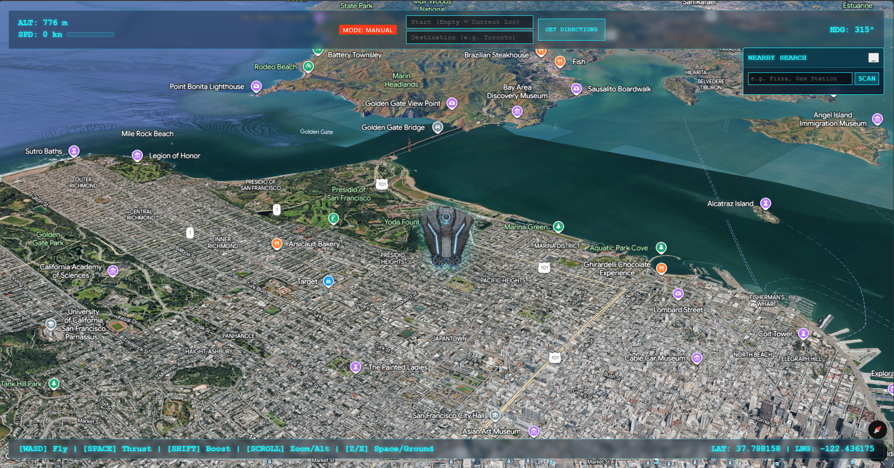

# Google Drone 🚁🌍

A futuristic, 3D flight simulator built entirely in the browser using the **Google Maps Platform 3D Maps API** (Alpha Channel).

Fly a drone over photorealistic 3D tiles, execute search missions for real-world places, and engage auto-pilot for cinematic travel.



## 🌟 Features

*   **3D Flight Physics**: Smooth dampening, inertia-based thrust, and realistic banking.
*   **Ace Pilot Controls**: WASD + Mouse Look control scheme inspired by modern flight sims.
*   **Auto-Pilot System**: Enter any destination (e.g., "Eiffel Tower") and watch the drone navigate there automatically using the **Routes API**.
*   **Places Scanner**: Search for nearby POIs (Pizza, Gas, Museums) and spawn 3D markers to investigate.
*   **Space Capable**: Seamlessly transition from street level (20m) to Orbit (5,000km) with a single keystroke.

## 🎮 Controls

| Action | Key / Input |
| :--- | :--- |
| **Thrust** | `SPACE` (Hold) |
| **Boost** | `SHIFT` + `SPACE` |
| **Brake / Reverse** | `CTRL` |
| **Pitch (Nose Up/Down)** | `W` / `S` |
| **Yaw (Turn Left/Right)** | `A` / `D` |
| **Zoom / Altitude** | `Scroll Wheel` |
| **Orbit Jump** | `Z` |
| **Ground Dive** | `X` |
| **Level Drone** | `R` |

## 🚀 Getting Started

### Prerequisites

1.  **Node.js** installed on your machine.
2.  A **Google Cloud Project** with billing enabled.
3.  A **Google Maps API Key** with the following APIs enabled:
    *   **Maps JavaScript API**
    *   **Places API (New)**
    *   **Routes API** (Directions)

### Installation

1.  **Clone the repository:**
    ```bash
    git clone https://github.com/YOUR_USERNAME/google_drone.git
    cd google_drone
    ```

2.  **Install dependencies:**
    ```bash
    npm install
    ```

3.  **Configure API Key:**
    *   Create a file named `.env` in the root directory.
    *   Add your API Key:
        ```env
        GOOGLE_MAPS_API_KEY=AIzaSyYourSecretKeyHere...
        ```
    *   *Note: This project uses a backend proxy to inject the key, or you can hardcode it in `index.html` for local testing.*

4.  **Launch the Flight Deck:**
    ```bash
    npm start
    ```

5.  **Open your browser:**
    Navigate to `http://localhost:8080`

## 🛠️ Built With

*   [Google Maps Platform](https://developers.google.com/maps) - Photorealistic 3D Tiles
*   [Node.js](https://nodejs.org/) - Server runtime
*   [Express](https://expressjs.com/) - Web framework

## ⚠️ Notes

*   This project uses the **Alpha Channel** (`v=alpha`) of the Maps JavaScript API. Features are experimental and subject to change.
*   Ensure **Hardware Acceleration** is enabled in your browser for 3D rendering.

---
*Generated with ❤️ by Gemini Code Assist*